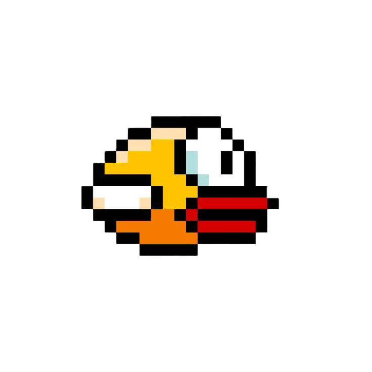

# Flappy Bird Game - Flutter



## Mô tả

Đây là một bản sao lại của trò chơi Flappy Bird nổi tiếng, được phát triển bằng Flutter và Flame Engine. Trong game này, người chơi điều khiển một chú chim bay qua các cột chướng ngại vật. Mỗi khi vượt qua được một cột, người chơi sẽ được cộng một điểm. Trò chơi kết thúc khi chim va chạm vào cột hoặc rơi xuống đất.

## Tính năng

- Đồ họa đơn giản, dễ nhìn
- Cơ chế chơi đơn giản: chạm để chim bay lên
- Hệ thống tính điểm
- Lưu điểm cao nhất
- Hiệu ứng va chạm tự nhiên (chim rơi xuống đất khi va chạm với cột)
- Phù hợp với mọi kích thước màn hình

## Yêu cầu hệ thống

- Flutter SDK (phiên bản 3.6.2 trở lên)
- Dart SDK (phiên bản 3.6.2 trở lên)
- Thiết bị Android/iOS hoặc máy tính có thể chạy ứng dụng Flutter

## Cài đặt

1. Clone repository:
   ```bash
   git clone https://github.com/your-username/flappy_bird_project.git
   ```

2. Di chuyển đến thư mục dự án:
   ```bash
   cd flappy_bird_project
   ```

3. Cài đặt các dependencies:
   ```bash
   flutter pub get
   ```

4. Chạy ứng dụng:
   ```bash
   flutter run
   ```

## Cấu trúc dự án

```
lib/
  ├── main.dart              # Điểm khởi đầu của ứng dụng
  ├── game/                  # Các thành phần chính của game
  │   ├── background.dart    # Nền của game
  │   ├── bird.dart          # Nhân vật chính (chim)
  │   ├── flappy_bird_game.dart  # Lớp chính điều khiển game
  │   ├── flash_effect.dart  # Hiệu ứng flash khi va chạm
  │   ├── ground.dart        # Mặt đất
  │   └── pipe.dart          # Các cột chướng ngại vật
  ├── models/                # Dữ liệu và trạng thái của game
  │   ├── game_state.dart    # Trạng thái hiện tại của game
  │   └── player_data.dart   # Dữ liệu người chơi (điểm cao,...)
  ├── screens/               # Các màn hình
  │   ├── game_screen.dart   # Màn hình chơi game
  │   └── main_menu_screen.dart  # Màn hình menu chính
  ├── utils/                 # Các tiện ích
  │   └── constants.dart     # Các hằng số sử dụng trong game
  └── widgets/               # Các widget UI
      ├── custom_button.dart # Nút tùy chỉnh
      └── game_over_menu.dart # Menu khi game kết thúc
```

## Cách chơi

1. Mở ứng dụng và nhấn vào màn hình để bắt đầu trò chơi
2. Chạm vào màn hình để làm cho chim bay lên
3. Tránh các cột chướng ngại vật và đừng để chim rơi xuống đất
4. Mỗi khi vượt qua một cặp cột, bạn sẽ nhận được một điểm
5. Cố gắng đạt điểm cao nhất!

- HoangKhoiDev
